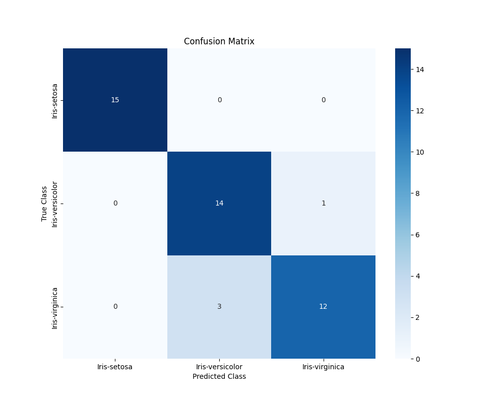
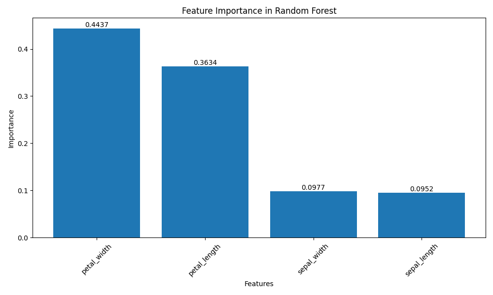

# 一、随机森林的理解与实现

使⽤numpy从头实现⼀个随机森林算法，拟合数据集
对提供的特征的重要性进⾏评估并可视化

## 1. 数据集划分

每个特征分别划分，取0.7做训练集，0.3做测试集
这种划分在小数据集上较为常见。
打乱数据后再按类别划分

## 2. 构建随机森林模型

### 选择CART决策树
- **处理连续特征**：能直接处理 Iris 数据集的 4 个连续特征，无需额外预处理。
- **分类任务支持**：使用基尼指数，支持多分类，适用于 3 个类别的分类问题。
- **随机森林兼容性**：CART 是随机森林中最常用的决策树算法，其二叉树结构和高效性与集成学习框架高度匹配。

## 特征选择
- 在每个节点，使用基尼指数（Gini Index）作为特征选择的准则。基尼指数衡量数据的不纯度，公式为：
$$
Gini(D) = 1 - \sum_{i=1}^{3} p_i^2
$$
- 其中 $p_i$ 是当前节点中类别 $i$ 的比例（Iris 有 3 个类别）。
- **节点分裂**：
    - 对每个特征，尝试所有可能的阈值（因为特征是连续值），计算分裂后左右子节点的基尼指数加权平均，选择使基尼指数下降最多的特征和阈值进行分裂。
- **停止条件**：
    - 设置以下条件之一停止树的生长：
        - 节点样本全属于同一类别。
        - 样本数量小于某个最小值（2）。
        - 树深度达到最大值（5）。

## 随机森林构建
- **Bootstrap 采样**：
    - 从训练集（105 条记录）中有放回地随机抽取 105 条记录，生成一个子数据集。
    - 重复此过程，为每棵决策树生成一个独立的 Bootstrap 样本。
- **特征子集选择**：
    - 在每个节点分裂时，从 4 个特征中随机选择一个子集（建议选择 2 个特征）。
    - 只在选定的特征子集中寻找最优分裂点。
- **构建多棵决策树**：
    - 确定随机森林中决策树的棵数（建议 100 棵）。
    - 对每个 Bootstrap 样本，使用上述 CART 算法构建一棵决策树。
- **注意事项**：
    - 每棵树独立构建，不进行剪枝，随机森林通过集成多棵树来控制过拟合。

## 训练随机森林模型

- **训练过程**：
    - 对每个 Bootstrap 样本，使用 CART 算法训练一棵决策树。
    - 在每个节点分裂时，确保只从随机选择的特征子集中挑选最优特征和阈值。
- **模型保存**：
    - 将所有训练好的决策树（例如 100 棵）保存为一个随机森林模型，供后续预测使用。

## 实现预测方法

- **单棵树的预测**：
    - 对于测试集中的一个样本，从树的根节点开始，根据特征值和分裂条件遍历到叶节点，输出叶节点的类别（多数类别）。
- **随机森林的预测**：
    - 对测试集中的每个样本，让所有决策树（例如 100 棵）分别预测。
    - 使用**多数投票**方法确定最终类别：
        - 统计每棵树预测的类别，得票最多的类别作为随机森林的预测结果。
    - **可选**：记录每个类别的得票数，计算得票比例，作为预测的置信度。

## 实现评价函数与模型评估

- ### 选择评价指标
	- **准确率**
	- **精确率（Precision）、召回率（Recall）、F1 分数（F1-Score）**
		- 对每个类别分别计算
	- **混淆矩阵（Confusion Matrix）**：
	    - 构建一个 3x3 矩阵（因为有 3 个类别），行表示真实类别，列表示预测类别，记录每个类别的预测情况。
- ### 实现评价函数
	- **输入**：测试集的真实标签和随机森林的预测标签。
	- **步骤**：
	    1. 计算准确率：
	        - 比较预测标签和真实标签，统计正确预测的样本数，除以测试集总数（45）。
	    2. 构建混淆矩阵：
	        - 初始化一个 3x3 矩阵，遍历测试集样本，根据真实标签和预测标签填充矩阵。
	    3. 计算每个类别的精确率、召回率和 F1 分数：
	        - 从混淆矩阵中提取每个类别的真阳性（TP）、假阳性（FP）、假阴性（FN），代入公式计算。
	- **输出**：准确率、混淆矩阵、每个类别的精确率、召回率和 F1 分数。
- ### 评估模型
	- **预测**：
	    - 使用测试集（45 条记录）对随机森林进行预测，得到预测标签。
	    - **使用5折交叉验证**
	- **计算指标**：
	    - 使用你实现的评价函数，计算上述指标。
	- **分析结果**：
	    - 检查准确率是否较高（例如 >90%），表示模型整体性能良好。
	    - 查看混淆矩阵，分析是否存在某个类别预测不准确（例如，某个类别的对角线值较低）。
	    - 比较每个类别的精确率和召回率，判断模型是否对某些类别偏倚。
## 优化
- 尝试不同超参数（50，200）
- 调整最大深度（max_depth）或最小样本数（min_samples_split），看看是否能提升准确率。

### 特征重要性评估方法

#### 基于基尼指数减少量的特征重要性计算
本实现使用了基于基尼指数减少量(Gini Impurity Decrease)的方法来评估特征重要性。这是一种基于决策树的特征重要性评估方法，具体计算过程如下：

1. **基本原理**：
   - 对于决策树中的每个分裂节点，计算该分裂导致的基尼指数减少量
   - 将减少量归功于用于分裂的特征
   - 最终特征重要性是所有树中该特征导致的基尼指数减少量的平均值

2. **计算步骤**：
   ```python
   对于随机森林中的每棵树:
       对于树中的每个分裂节点:
           # 计算分裂前的基尼指数
           gini_parent = 1 - Σ(p_i^2)  # p_i是类别i的比例
           
           # 计算分裂后的加权基尼指数
           gini_left = 1 - Σ(p_left_i^2)   # 左子节点的基尼指数
           gini_right = 1 - Σ(p_right_i^2)  # 右子节点的基尼指数
           
           # 计算加权平均
           gini_children = (n_left * gini_left + n_right * gini_right) / n_total
           
           # 计算基尼指数减少量
           gini_decrease = gini_parent - gini_children
           
           # 将减少量添加到对应特征的重要性分数中
   ```

3. **归一化处理**：
   - 对每棵树的特征重要性求平均
   - 将所有特征的重要性归一化，使其总和为1

4. **优势**：
   - 直接反映特征对纯度提升的贡献
   - 考虑了节点中样本的数量（加权平均）
   - 可以跨树累积和平均，得到整体评估

### 特征重要性分析功能改进

#### 主要修改
- 添加了 `feature_importance` 方法，用于计算随机森林的整体特征重要性
- 移除了单棵决策树的特征选择测试

#### 功能实现细节
1. 特征重要性计算流程:
   - 收集所有树中每个特征的基尼指数减少量
   - 计算每个特征的平均重要性
   - 按重要性降序排序特征

#### 改进效果
- 输出更全面的特征重要性分析结果
- 基于整个随机森林而非单棵决策树
- 结果更具代表性和可靠性

#### 最终输出

```bash
训练集大小: (105, 4)
测试集大小: (45, 4)

=== 开始随机森林训练 ===

=== 开始训练随机森林 ===
配置信息:
- 决策树数量: 100
- 最大树深度: 5
- 最小样本数: 2
- 特征子集大小: 2
训练决策树: 100%|██████████████████████████████████████████████████████████████████████| 100/100 [00:00<00:00, 323.35it/s]

=== 随机森林训练完成 ===

=== 特征重要性分析 ===

特征重要性排序:
petal_width : 0.4121
petal_length: 0.3730
sepal_length: 0.1175
sepal_width : 0.0974

模型已保存到: task1/random_forest_model.pkl

模型已从 task1/random_forest_model.pkl 加载

=== 单个样本预测示例 ===
样本特征: {'sepal_length': 7.3, 'sepal_width': 2.9, 'petal_length': 6.3, 'petal_width': 1.8}
真实类别: Iris-virginica
预测类别: Iris-virginica
预测概率: {'Iris-virginica': 1.0}

=== 测试集预测 ===

开始预测...

测试集准确率: 0.9111

部分预测结果示例:

样本 1:
真实类别: Iris-virginica
预测类别: Iris-virginica
预测概率: {'Iris-virginica': 1.0}

样本 2:
真实类别: Iris-versicolor
预测类别: Iris-versicolor
预测概率: {'Iris-versicolor': 1.0}

样本 3:
真实类别: Iris-virginica
预测类别: Iris-versicolor
预测概率: {'Iris-versicolor': 0.54, 'Iris-virginica': 0.46}

样本 4:
真实类别: Iris-versicolor
预测类别: Iris-versicolor
预测概率: {'Iris-setosa': 0.04, 'Iris-versicolor': 0.62, 'Iris-virginica': 0.34}

样本 5:
真实类别: Iris-virginica
预测类别: Iris-virginica
预测概率: {'Iris-versicolor': 0.14, 'Iris-virginica': 0.86}

=== 模型评估 ===

在测试集上的评估结果:

开始预测...

整体准确率: 0.9111

各类别的评估指标:

类别 Iris-setosa:
精确率: 1.0000
召回率: 1.0000
F1分数: 1.0000

类别 Iris-versicolor:
精确率: 0.8235
召回率: 0.9333
F1分数: 0.8750

类别 Iris-virginica:
精确率: 0.9231
召回率: 0.8000
F1分数: 0.8571
2025-03-14 09:05:52.615 python[97468:947745] +[IMKClient subclass]: chose IMKClient_Modern
2025-03-14 09:05:52.615 python[97468:947745] +[IMKInputSession subclass]: chose IMKInputSession_Modern

=== 5折交叉验证 ===

训练第 1 折...

=== 开始训练随机森林 ===
配置信息:
- 决策树数量: 100
- 最大树深度: 5
- 最小样本数: 2
- 特征子集大小: 2
训练决策树: 100%|██████████████████████████████████████████████████████████████████████| 100/100 [00:00<00:00, 291.49it/s]

=== 随机森林训练完成 ===

开始预测...
第 1 折准确率: 0.9667

训练第 2 折...

=== 开始训练随机森林 ===
配置信息:
- 决策树数量: 100
- 最大树深度: 5
- 最小样本数: 2
- 特征子集大小: 2
训练决策树: 100%|██████████████████████████████████████████████████████████████████████| 100/100 [00:00<00:00, 287.14it/s]

=== 随机森林训练完成 ===

开始预测...
第 2 折准确率: 0.9667

训练第 3 折...

=== 开始训练随机森林 ===
配置信息:
- 决策树数量: 100
- 最大树深度: 5
- 最小样本数: 2
- 特征子集大小: 2
训练决策树: 100%|██████████████████████████████████████████████████████████████████████| 100/100 [00:00<00:00, 252.29it/s]

=== 随机森林训练完成 ===

开始预测...
第 3 折准确率: 1.0000

训练第 4 折...

=== 开始训练随机森林 ===
配置信息:
- 决策树数量: 100
- 最大树深度: 5
- 最小样本数: 2
- 特征子集大小: 2
训练决策树: 100%|██████████████████████████████████████████████████████████████████████| 100/100 [00:00<00:00, 279.52it/s]

=== 随机森林训练完成 ===

开始预测...
第 4 折准确率: 0.9333

训练第 5 折...

=== 开始训练随机森林 ===
配置信息:
- 决策树数量: 100
- 最大树深度: 5
- 最小样本数: 2
- 特征子集大小: 2
训练决策树: 100%|██████████████████████████████████████████████████████████████████████| 100/100 [00:00<00:00, 274.24it/s]

=== 随机森林训练完成 ===

开始预测...
第 5 折准确率: 0.9667

交叉验证结果:
平均准确率: 0.9667
标准差: 0.0211
```
1.特征重要性分析：
- petal_width (花瓣宽度): 0.4121 - 最重要的特征
- petal_length (花瓣长度): 0.3730 - 第二重要
- sepal_length (萼片长度): 0.1175 - 较不重要
- sepal_width (萼片宽度): 0.0974 - 最不重要

这表明花瓣的特征（宽度和长度）对鸢尾花分类贡献最大，合计约占78.5%的重要性。

2.单个样本预测示例：
对于具体样本的预测显示了很高的置信度（概率为1.0）
预测结果与真实类别相符

3.测试集性能：
整体准确率：0.9111 
部分预测结果显示了预测的概率分布，有些预测非常确定（概率接近1），有些则较不确定（如样本3和4）

4.各类别的详细评估指标：

Iris-setosa:
- 精确率: 1.0000
- 召回率: 1.0000 
- F1分数: 1.0000
(完美分类)

Iris-versicolor:
- 精确率: 0.8235
- 召回率: 0.9333
- F1分数: 0.8750

Iris-virginica:
- 精确率: 0.9231
- 召回率: 0.8000
- F1分数: 0.8571

5.交叉验证结果分析：
- 平均准确率: 0.9667 (96.67%)
- 标准差: 0.0211 (较小,说明模型性能稳定)
- 各折准确率: 0.9667, 0.9667, 1.0000, 0.9333, 0.9667

#### 混淆矩阵图



### 特征重要性排名



# 结论：
1. 模型整体表现优异，在交叉验证中达到96.67%的准确率，且标准差仅为0.0211，表明性能稳定可靠

2. 在三个鸢尾花品种的分类中：
   - Iris-setosa可以被完美分类（精确率和召回率均为1.0）
   - Iris-versicolor和Iris-virginica也有较好表现，但存在少量混淆
   - 主要混淆发生在versicolor和virginica之间，这与这两个品种的相似性较高有关

3. 特征重要性分析显示：
   - 花瓣特征(宽度0.4121、长度0.3730)对分类贡献最大，合计占78.5%
   - 萼片特征(长度0.1175、宽度0.0974)的影响相对较小

4. 模型在不同评估方法下均表现稳定：
   - 交叉验证结果优于单次测试
   - 较小的标准差(0.0211)证实了模型的稳定性
   - 各折验证准确率波动范围小，进一步验证了模型的可靠性

