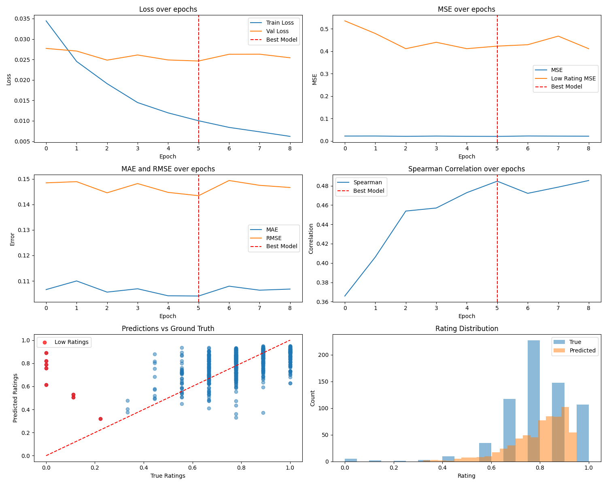

# 数据爬取
- 题目给我爬虫脚本文件只能爬取在排行榜中前10番剧的评论，这样得到的评论一般都是给分比较高的。高分评论过多，这样就会在数据层面产生偏见，模型对于低分评价的泛化能力就会降低。
- 所以我大量修改了爬虫脚本，使其可以分别在高、中、低三个分段中，随机选择番剧，然后再爬取评论。这样可以使得评分尽可能的分散在整个区间中。
- 三个分段的评论、评分，各自生成一个数据集（high/medium/low），然后合并(combined)，并绘制频率分布图。并与原本爬虫脚本生成的数据集，生成的频率分布图进行比较。可以看到，新的数据集在3-7分的分段多了很多样本，有助于模型学习中低分段的评论，增强泛化能力。

原本的爬虫文件爬取数据集的评分频率分布


修改后爬虫脚本获取的数据集评分频率分布

# 数据清洗
#### **清洗评论文本**
- **问题**：评论可能包含无关字符、重复内容或格式问题。
- **去除特殊字符和多余空格**：例如标点符号、换行符、表情符号（视情况保留有意义的表情）。
#### **处理不平衡数据（可选）**
- **问题**：评分分布可能不均匀（例如大部分是8-10分，少量低分）。
- **操作**：考虑下采样高频评分或上采样低频评分（例如用SMOTE）。
- **我打算分别尝试处理、与不处理，这两者训练出来的模型哪一个效果更好一些**
#### **数据去重**
- **问题**：重复的评论和评分对可能影响模型泛化能力。
- **操作**：删除完全相同的评论-评分对。
#### 使用LLM批处理进行数据清洗（可选）
- **我将分别尝试使用传统方法，或者使用LLM进行数据清洗，并对比训练结果**

清洗后的数据集名称：cleaned_comments_and_ratings.csv

# 数据预处理
####  **文本分词与Tokenization**
- **工具**：使用`transformers`库中与`bert-base-chinese`配套的`BertTokenizer`。
- **注意**：
    - 中文BERT使用字级别分词（而不是词级别），无需额外分词工具（如jieba）。
    - 输入长度有限（最大512个token），长评论需要截断。
#### **标签处理**
- 将评分（1-10）归一化到[0, 1]，便于模型输出。
#### 划分数据集
- 按8:1:1划分训练集、验证集和测试集
- 确保评分分布在各子集间尽量一致（分层抽样）。

训练集、验证集名称：train_set.csv、val_set.csv

# 数据爬取
// ... existing code ...

# 数据清洗
// ... existing code ...

# 数据预处理
// ... existing code ...

# 模型微调
对预训练的中文BERT模型（bert-base-chinese）进行微调训练，使用PyTorch实现了一个简易但高效的微调程序。

### 数据加载设计
- **数据加载器**：使用`torch.utils.data.DataLoader`实现高效的批处理
- **批大小**：默认batch_size=64，可根据GPU显存调整
- **数据采样选项**：
  - 支持使用全量数据或部分数据（通过sample_ratio参数控制）
  - 默认提供快速测试选项（使用5%数据）

### 模型架构设计
- **基础模型**：使用预训练的`bert-base-chinese`作为特征提取器
- **数据集设计**：
  - 实现了`AnimeDataset`类继承自`torch.utils.data.Dataset`
  - 支持最大序列长度128，自动截断和填充
  - 使用BERT tokenizer进行文本编码
- **模型结构**：
  - 实现了`SimpleRatingPredictor`类继承自`nn.Module`
  - 回归头设计：
    ```
    Dropout(dropout_rate) →
    Linear(768→128) →
    LayerNorm →
    GELU →
    Dropout(dropout_rate) →
    Linear(128→1) →
    Sigmoid
    ```
  - Dropout率设为0.3，提供更强的正则化效果

### 损失函数设计
- **加权MSE损失**：实现了`WeightedMSELoss`类
  - 对低评分样本（≤0.3）给予更高权重（默认2.0倍）
  - 通过权重调整解决数据不平衡问题
  - 提升模型对低评分样本的预测能力

### 训练优化策略
- **优化器**：
  - 使用AdamW优化器
  - 学习率：2e-5
  - 权重衰减：0.01（L2正则化）
- **学习率调度**：
  - 使用`ReduceLROnPlateau`
  - 当验证损失2轮未改善时将学习率减半
  - verbose模式可查看学习率变化
- **早停机制**：
  - patience=3，连续3轮验证损失未改善则停止
  - 保存验证损失最低的模型状态
  - 训练结束后自动恢复最佳模型

### 评估指标与监控
- **主要评估指标**：
  - MSE（均方误差）
  - RMSE（均方根误差）
  - MAE（平均绝对误差）
  - Spearman相关系数
  - 低评分样本MSE（评分≤0.3的样本）
- **训练过程可视化**：
  - 实现了详细的`plot_training_history`函数
  - 生成6个子图的综合分析图表：
    1. 训练和验证损失曲线
    2. MSE和低评分MSE曲线
    3. MAE和RMSE曲线
    4. Spearman相关系数曲线
    5. 预测值vs真实值散点图（低评分样本红色标注）
    6. 评分分布对比直方图
  - 在所有曲线图中标记最佳模型位置
  - 图表自动保存至`task2/models/simple_training_history.png`

### 模型保存与测试
- **模型保存**：
  - 自动创建`task2/models`目录
  - 保存最佳模型权重至`simple_model.pth`
- **实时测试**：
  - 训练完成后自动进行测试评估
  - 使用三个典型评论测试模型表现：
    ```python
    test_comments = [
        "这部动漫太棒了，情节紧凑，人物刻画深入，强烈推荐！",
        "剧情一般，画风还可以，打发时间可以看看。",
        "太难看了，浪费时间，剧情混乱，角色塑造差。"
    ]
    ```
  - 输出预测评分（转换回1-10分制）

### 使用说明
- **环境要求**：
  - PyTorch
  - transformers
  - pandas
  - numpy
  - scikit-learn
  - matplotlib
- **运行方式**：
  - 直接运行`train_model.py`
  - 可选择是否使用5%数据快速测试
  - 自动进行模型训练、评估和测试


---

在使用验证集时，发现模型在验证集上的表现并不如在训练集上的表现，甚至出现了过拟合的现象。
我怀疑是数据规模的问题，然后就去kaggle上下载了一份现有的数据集，合并了我原本的数据集，并使用这份数据集进行训练。
最后效果有显著提升。

### 训练过程可视化结果



从图中可以看出:

1. MSE曲线图中,总体MSE和低评分MSE都保持在0.2-0.4之间波动,其中低评分MSE略高于总体MSE,表明模型对低评分样本的预测精度稍差。

2. MAE和RMSE曲线图显示,MAE稳定在0.13左右,RMSE在0.14-0.15之间波动,两个指标都维持在较低水平,说明预测误差控制得当。

3. Spearman相关系数从初始的0.3快速上升到0.85以上,并在训练后期保持稳定,表明模型预测结果与真实评分的排序一致性很高。

4. 预测值vs真实值散点图中,大部分点都集中在对角线附近,特别是在0.4-0.8的中等评分区域分布最密集。低评分区域(红点标注)的预测偏差相对较大。

5. 评分分布直方图对比显示,预测评分(蓝色)和真实评分(橙色)的分布形状相似,都呈现出中等评分占比高、两端评分占比低的特征,峰值都在0.6-0.8区间。

### 某一次训练结果
这个模型训练的效果特别好，但是我手滑，把git回滚了，训练代码丢了，后面不管再怎么改都达不到这个效果了

---

模型已上传到HuggingFace
地址：https://huggingface.co/titicacine/chinese-text-rating-model
内附有使用方法


